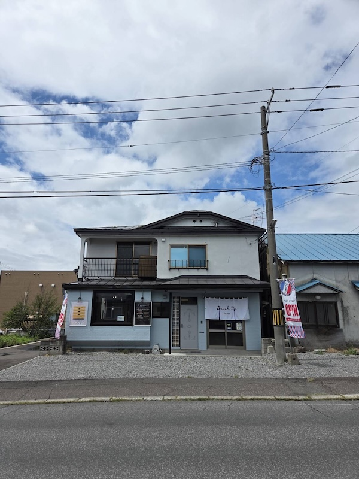

# Brush Up Stores

日本語は英語の後に続きます。

A responsive, bilingual website designed and developed for **Brush Up Stores**, a local walk-in barbershop in Asahikawa, Hokkaido, Japan.

[View the Live Website](https://brushup-stores.pages.dev/)



## 🌟 Highlights

- Designed and developed for a local business based on direct client requirements
- Responsive design across a range of screen sizes
- Japanese and English language support
- Custom JavaScript localization system using JSON translation files
- Language preference saved between visits
- Google Maps integration for easy access to the store location
- Instagram integration for business updates and monthly opening schedules
- About Us page featuring the shop's DIY renovation and the story behind the business
- Design inspired by the shop's existing branding and physical storefront

## ℹ️ Overview

Brush Up Stores is a walk-in barbershop in Asahikawa, Hokkaido.

I designed and developed this website based on discussions with the shop owner, from the initial requirements and design ideas through to implementation.

The main goal was to create a simple but visually appealing website where customers could quickly find the information most important to them, including prices, opening hours, location, and the shop's Instagram account.

Unlike my previous personal projects, this project also gave me experience working directly with a client, interpreting their requirements, suggesting additional features, and turning those ideas into a finished website.

## 🎯 Client Requirements & Design Goals

### Client Requirements

The owner had several main requirements for the website:

- **Simple but appealing design** — The website should be easy to use while still having enough personality to represent the store.
- **Instagram integration** — Instagram is the owner's main platform for marketing and sharing store updates, so visitors needed to be able to find it easily from the website.
- **Easy-to-find location information** — As Brush Up Stores is a local physical business, customers needed a quick and simple way to find the store.

### My Suggestions

During the planning and design process, I also suggested several additions to help the website better represent the business.

#### About Us & DIY Story

Brush Up Stores was created through a major DIY renovation project.

I suggested creating an **About Us** page showing the transformation of the property through before-and-after photographs. This gives visitors a chance to learn the story behind the shop and see more of the owner's personality and the work that went into creating the business.

#### Japanese & English Support

I also suggested making the website bilingual.

The store occasionally receives international customers, and the owner can communicate with customers in English. Adding Japanese and English support therefore made the website more accessible to both local and international customers.

## 🛠️ From Requirements to Implementation

The client's requirements and our discussions directly influenced several parts of the finished website.

### Simple and Distinctive Design

I created a custom responsive design rather than using a pre-built website template.

The visual style uses bold outlines, strong typography, simple shapes, and colors inspired by the shop's existing branding and storefront.

The layout keeps important information such as prices, opening hours, and location easy to scan while giving the website its own visual identity.

### Instagram Integration

Instagram links are placed prominently throughout the website.

The opening-hours section also directs customers to Instagram for the latest monthly business calendar, allowing the owner to continue using his existing platform for frequently changing information rather than having to constantly update the website.

### Location & Google Maps

The location section includes an embedded Google Map, the store address, and a direct link to Google Maps.

This gives visitors multiple ways to quickly find the shop and open directions on their device.

### Bilingual Localization

Rather than creating separate Japanese and English copies of every page, I implemented a lightweight localization system using JavaScript and JSON.

Visible text is connected to translation keys using custom `data-i18n` attributes:

```html
<h2 data-i18n="hours.heading"></h2>
```

Translation strings are stored in separate Japanese and English JSON files. JavaScript reads the relevant translation key and updates the page content when the selected language changes.

The user's language preference is saved using `localStorage`, allowing the selected language to persist when navigating between pages or returning to the website.


# Brush Up Stores

北海道旭川市のカット専門店 **Brush Up Stores** のために、デザインから開発まで担当したレスポンシブ・バイリンガルWebサイトです。

[Webサイトを見る](https://brushup-stores.pages.dev/)


## 🌟 特徴

- 実際のクライアントの要望をもとに、デザインから開発まで担当
- さまざまな画面サイズに対応したレスポンシブデザイン
- 日本語・英語の2言語に対応
- JSON翻訳ファイルとJavaScriptを使用した独自のローカライズ機能
- 選択した言語を保存し、次回アクセス時にも設定を維持
- Google Mapsを利用し、店舗の場所を簡単に確認可能
- 店舗情報や毎月の営業カレンダーを確認できるInstagramへの導線
- 店舗のDIYリノベーションと開業までのストーリーを紹介する「お店について」ページ
- 店舗の既存のブランドイメージや外観を活かしたデザイン

## ℹ️ 概要

Brush Up Storesは、北海道旭川市にある予約不要のカット専門店です。

店舗オーナーとの打ち合わせをもとに、初期の要件整理やデザインの検討から実装まで、Webサイトのデザイン・開発を担当しました。

料金、営業時間、アクセス、Instagramなど、お客様が知りたい情報をすぐに確認できることを重視しながら、シンプルでありながら店舗らしさを感じられるWebサイトを目指しました。

これまでの個人開発とは異なり、このプロジェクトでは実際のクライアントと直接やり取りをしながら、要望を整理し、自分から追加機能を提案し、それらを実際のWebサイトとして形にする経験を得ることができました。

## 🎯 クライアントの要望とデザイン目標

### クライアントからの要望

オーナーからは、主に以下の要望がありました。

- **シンプルで魅力のあるデザイン** — 使いやすさを保ちながら、店舗らしさや個性を感じられるWebサイトにすること。
- **Instagramとの連携** — オーナーはInstagramを主な集客・情報発信ツールとして利用しているため、Webサイトから簡単にInstagramへアクセスできるようにすること。
- **分かりやすいアクセス情報** — 地域密着型の実店舗のため、お客様が店舗の場所をすぐに確認できるようにすること。

### 私からの提案

企画・デザインを進める中で、店舗の魅力をより伝えるために、私からもいくつかの機能やコンテンツを提案しました。

#### 「お店について」・DIYストーリー

Brush Up Storesは、物件を大規模にDIYでリノベーションして作り上げた店舗です。

そこで、リノベーション前後の写真を使って店舗が完成するまでの過程を紹介する「お店について」ページを提案しました。店舗ができるまでのストーリーや、オーナー自身の人柄をお客様により身近に感じてもらえるようなページを目指しました。

#### 日本語・英語対応

Webサイトを日本語と英語の2言語に対応させることも提案しました。

店舗には外国人のお客様が来店することもあり、オーナー自身も英語での接客が可能です。そのため、日本語・英語の両方に対応することで、地域のお客様だけでなく外国人のお客様にも利用しやすいWebサイトを目指しました。

## 🛠️ 要望から実装へ

クライアントからの要望や打ち合わせで決まった内容をもとに、Webサイトの各機能やデザインを実装しました。

### シンプルで個性のあるデザイン

既存のWebサイトテンプレートは使用せず、店舗に合わせたオリジナルのレスポンシブデザインを作成しました。

太めのアウトライン、印象的なタイポグラフィ、シンプルな図形などを取り入れ、店舗の既存のブランドイメージや外観から着想を得たカラーを使用しています。

料金、営業時間、アクセスなどの重要な情報を確認しやすくしながら、店舗独自の雰囲気を感じられるデザインを目指しました。

### Instagramとの連携

Webサイトの複数の場所から、店舗のInstagramへ簡単にアクセスできるようにしました。

営業時間のセクションからも最新の営業カレンダーをInstagramで確認できるようにしています。これにより、月ごとに変更される情報については、オーナーが普段から使用しているInstagramで引き続き発信でき、Webサイトを毎回更新する必要がない構成にしました。

### アクセス・Google Maps

アクセスセクションにはGoogle Mapを埋め込み、店舗住所とGoogle Mapsへの直接リンクも設置しました。

Webサイト上で場所を確認するだけでなく、端末からGoogle Mapsを開いて店舗までのアクセスを確認しやすい構成にしています。

### バイリンガル対応

ページごとに日本語版・英語版のHTMLを個別に作成するのではなく、JavaScriptとJSONを使用した軽量なローカライズ機能を実装しました。

表示するテキストと翻訳キーは、独自の `data-i18n` 属性を使用して紐付けています。

```html
<h2 data-i18n="hours.heading"></h2>
```

日本語と英語の翻訳テキストは、それぞれ別のJSONファイルで管理しています。JavaScriptで選択された言語に対応する翻訳キーを取得し、ページ上のテキストを切り替えています。

また、選択された言語を `localStorage` に保存することで、別のページへ移動した場合や再度Webサイトを訪れた場合でも、ユーザーが選択した言語設定が維持されるようにしました。